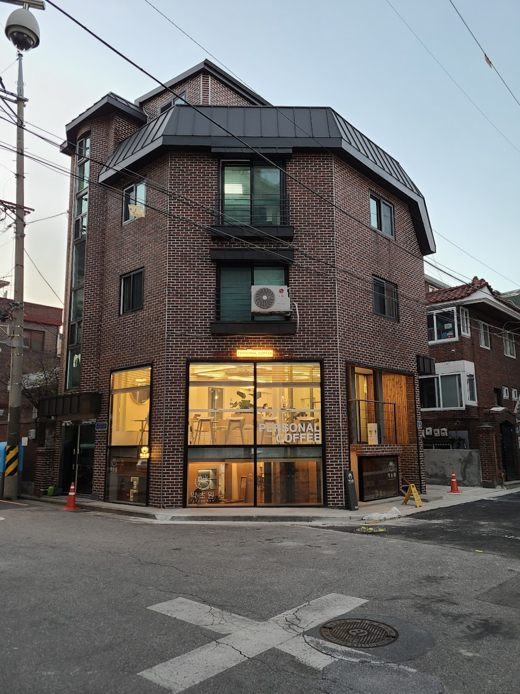

## 문제 1

Q: 다음 이미지에 대한 설명 중 옳지 않은 것은 무엇인가요?
- (1) 진열대에는 다양한 종류의 빵이 놓여 있습니다.
- (2) 점원은 하얀색 모자를 쓰고 있습니다.
- (3) 빵 위에 가격표가 붙어 있습니다.
- (4) 점원이 손님에게 커피를 건네고 있습니다.

Listening: Which of the following descriptions of the image is incorrect?
- (1) There are various types of bread displayed.
- (2) The clerk is wearing a white cap.
- (3) Price tags are placed on the bread.
- (4) The clerk is handing coffee to a customer.

정답: (4) 점원이 커피를 건네는 모습이 아니라 빵을 정리하는 모습입니다.

-----------------------

## 문제 2

Q: 다음 이미지에 대한 설명 중 옳지 않은 것은 무엇인가요?
- (1) 많은 사람들이 노트북을 사용하고 있습니다.
- (2) 강연이 진행 중인 모습입니다.
- (3) 천장에는 여러 조명의 불빛이 있습니다.
- (4) 'DIVE 2024 IN BUSAN'이라는 문구가 보입니다.

Listening: Which of the following descriptions of the image is incorrect?
- (1) Many people are using laptops.
- (2) A presentation is in progress.
- (3) There are several lights on the ceiling.
- (4) The phrase 'DIVE 2024 IN BUSAN' is visible.

정답: (2) 강연이 진행 중이지 않으며, 사람들은 개인 작업을 하고 있는 것처럼 보입니다.

-----------------------

## 문제 3

Q: 다음 이미지에 대한 설명 중 옳지 않은 것은 무엇인가요?
- (1) 사람들이 건물을 앞에서 작업을 하고 있습니다.
- (2) 베이커리 카페의 이름이 'pomme verte'입니다.
- (3) 오른쪽 가게는 화장품을 판매합니다.
- (4) 작업자 중 한 명이 빨간색 셔츠를 입고 있습니다.

Listening: Which of the following descriptions of the image is incorrect?
- (1) People are working in front of the building.
- (2) The name of the bakery cafe is 'pomme verte'.
- (3) The store on the right sells cosmetics.
- (4) One of the workers is wearing a red shirt.

정답: (4) 작업자 중 빨간색 셔츠를 입고 있는 사람은 없습니다.

-----------------------

## 문제 4

Q: 다음 이미지에 대한 설명 중 옳지 않은 것은 무엇인가요?
- (1) 카페 내부의 모습이 담겨 있습니다.
- (2) 노란색 벽 앞에 긴 카운터가 있습니다.
- (3) 사람들이 카운터에서 주문을 하고 있습니다.
- (4) 카페는 외부에 위치해 있습니다.

Listening: Which of the following descriptions of the image is incorrect?
- (1) It shows the interior of a café.
- (2) There is a long counter in front of a yellow wall.
- (3) People are ordering at the counter.
- (4) The café is located outdoors.

정답: (4) 카페는 실내에 위치해 있습니다.

-----------------------

## 문제 5

Q: 다음 이미지에 대한 설명 중 옳지 않은 것은 무엇인가요?  
- (1) 사람들이 앉아 대화를 나누고 있는 카페입니다.
- (2) 전등이 천장에 여러 개 설치되어 있습니다.
- (3) 큰 창문으로 햇빛이 들어오고 있습니다.
- (4) 사람들이 줄을 서서 주문을 하고 있습니다.

Listening: Which of the following descriptions of the image is incorrect?
- (1) It is a café where people are sitting and chatting.
- (2) There are several lights installed on the ceiling.
- (3) Sunlight is coming in through the large windows.
- (4) People are lining up to place orders.

정답: (4) 사람들이 줄을 서서 주문을 하고 있는 모습은 보이지 않습니다.

-----------------------

## 문제 6

Q: 다음 이미지에 대한 설명 중 옳지 않은 것은 무엇인가요?
- (1) 사람들이 커피숍 창문 밖에서 줄을 서 있습니다.
- (2) 여러 사람들이 대형 버스에 타고 있습니다.
- (3) 창문에 "COFFEE & BAKERY"라는 글자가 쓰여 있습니다.
- (4) 버스는 작은 승용차입니다.

Listening: Which of the following descriptions of the image is incorrect?
- (1) People are lined up outside the café window.
- (2) Several people are boarding a large bus.
- (3) The window has the words "COFFEE & BAKERY" written on it.
- (4) The bus is a small passenger car.

정답: (4) 버스는 작은 승용차가 아니라 대형 버스입니다.

-----------------------

## 문제 7

Q: 다음 이미지에 대한 설명 중 옳지 않은 것은 무엇인가요?
- (1) 큰 노란색 조형물이 보입니다.
- (2) 건물에 'Local Stitch'라는 글자가 쓰여 있습니다.
- (3) 붉은 벽돌로 된 건물이 보입니다.
- (4) 조형물은 초록색입니다.

Listening: Which of the following descriptions of the image is incorrect?
- (1) A large yellow sculpture is visible.
- (2) The building has the words 'Local Stitch' written on it.
- (3) There is a building made of red bricks.
- (4) The sculpture is green.

정답: (4) 조형물은 노란색이지 초록색이 아닙니다.

-----------------------

## 문제 8

Q: 다음 이미지에 대한 설명 중 옳지 않은 것은 무엇인가요?
- (1) 건물 외벽은 붉은 벽돌로 되어 있습니다.
- (2) 건물 1층에는 "PERSONAL COFFEE"라는 간판이 보입니다.
- (3) 건물 옆에는 파란색 고깔이 놓여 있습니다.
- (4) 교차로에 흰색 십자 표시가 있습니다.

Listening: Which of the following descriptions of the image is incorrect?
- (1) The building's exterior is made of red bricks.
- (2) On the first floor, there's a sign saying "PERSONAL COFFEE."
- (3) There is a blue cone next to the building.
- (4) There is a white cross marking at the intersection.

정답: (3) 건물 옆에는 파란색 고깔이 아닌 주황색 고깔이 놓여 있습니다.

-----------------------

